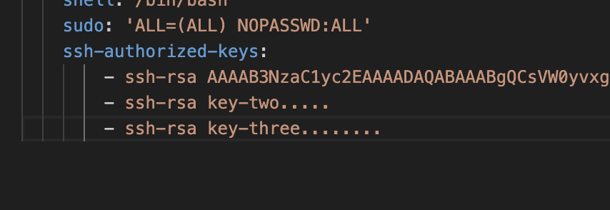

# AD-vulnbox-cloud
## Предварительная подготовка
Необходимо установить утилиты: [yc](https://cloud.yandex.ru/ru/docs/cli/quickstart), [terrafrom](https://developer.hashicorp.com/terraform/install?product_intent=terraform), [ansible](https://docs.ansible.com/ansible/latest/installation_guide/intro_installation.html) 

А также необходимо выолнить иницианлизацию CLI Yandex cloud:
```
yc init
```
Добавьте ваш открытый ключ(и) в файл [metadata.yml](./metadata.yml) в формате массива yaml



## Создание машины 
Виртуальная машина создаётся с помощью Terraform в Яндекс Облаке.
Для начала выполните импорт переменных окружения для конкретной работы terraform в яндекс облаке:
```bash
export YC_TOKEN=$(yc iam create-token)
export YC_CLOUD_ID=$(yc config get cloud-id)
export YC_FOLDER_ID=$(yc config get folder-id)
```
Далее инициализируйте провайдера и примените конфигурацию terraform:
```bash
terraform init
terraform apply --auto-approve 
```
После создания машины terraform выдаст её ip адрес.


## Подготовка машины
Чтобы запустить процедуру настройки введите следующую команду Ansible 
```bash
ansible-playbook -u admin --private-key ~/.ssh/id_rsa --ssh-common-args='-o StrictHostKeyChecking=no' provision.yml -i your_ip,
```
Замените *your_ip* на айпи адрес и не забудьте оставить запятую после него.
После выполнения настройки Ansible выведет summary по установленным инструментам
 

После этого можно подключаться и донастраивать вручную установленные инструменты

## Подключение 
Для подключения к ВМ используйте УЗ `admin`
```
ssh admin@your_ip
```
У `admin` настроен sudo c `ALL=(ALL) NOPASSWD:ALL`, работать с повышенными привилегиями можно без пароля.

Для удобной работы с несколькими терминальными сессиями предусмотрен tmux.

--- 
## TODO:
- Установка паролей на сервисы через переменную
- [Возможно] Подготовка образа в Packer